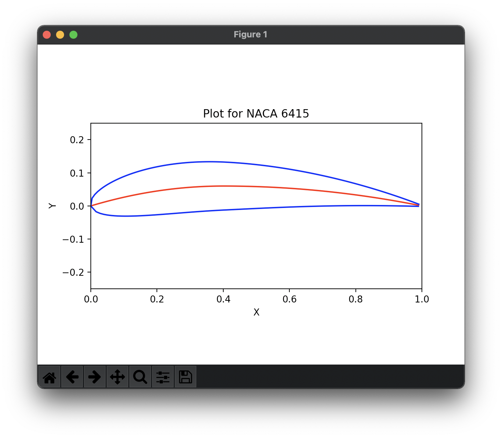

# NACA-Airfoil-Plotter
A python script that plots an airfoil given a NACA 4-digit designation.

## Installation and Setup
Clone this repository, navigate to it and install dependencies. Run the following to do so:
```
git clone https://github.com/chaubss/NACA-Airfoil-Plotter.git
cd NACA-Airfoil-Plotter/
pip3 install -r requirements.txt
```

## Usage
You can the code using:
```
python3 plot.py
```
Enter the 4-digit NACA designation and it's plot will be shown.

An example is given below:

